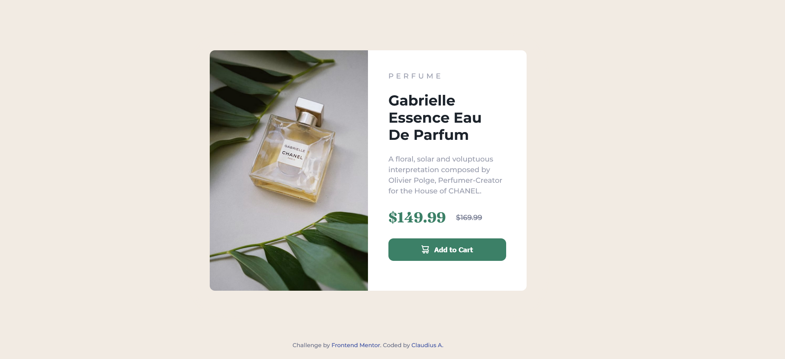

# Frontend Mentor - Product preview card component solution

This is a solution to the [Product preview card component challenge on Frontend Mentor](https://www.frontendmentor.io/challenges/product-preview-card-component-GO7UmttRfa). Frontend Mentor challenges help you improve your coding skills by building realistic projects.

## Table of contents

- [Overview](#overview)
  - [The challenge](#the-challenge)
  - [Screenshot](#screenshot)
  - [Links](#links)
- [My process](#my-process)
  - [Built with](#built-with)
  - [What I learned](#what-i-learned)
  - [Continued development](#continued-development)
- [Author](#author)

## Overview

### The challenge

Users should be able to:

- View the optimal layout depending on their device's screen size
- See hover and focus states for interactive elements

### Screenshot

## 01. DESKTOP



## 02. TABLET


## 03. MOBILE


### Links

- GitHub: [https://github.com/ClaudiusAyadi/2-Product-Card.git](https://github.com/ClaudiusAyadi/2-Product-Card.git)
- Live Site URL: [https://product-card-dovely.netlify.app/](https://product-card-dovely.netlify.app/)

## My process

1. I read the challenge brief on the Frontend Mentor website.
2. I downloaded the material provided and unzipped it into my working folder.
3. I set up a new repo for the challenge and push all the files to GitHub.
4. To start, I read through the style guide, then structured the HTML using the preview image provided, and set up the CSS root variables and font styles using the style guide.
5. Finally, I focused on the CSS to get a near-perfect design and added 100% responsiveness.
6. Pushed the final design to GitHub, deployed it to Netlify, submit the challenge, and updated the README.md.

### Built with

- Semantic HTML5 markup
- CSS custom properties
- Flexbox
- CSS Grid
- Mobile-first workflow

### What I learned

I finally learned to place the footer at the bottom of the screen. This has been my major issue when working with fullscreen design `(100vh)`. Using `place-items: center for grid` or `justify-content: center for flex (column direction)` would get the content centered on the screen. Issues arise when I try to place the footer at the bottom of the screen.

```html
<footer>Content</footer>
```

Using margin - auto solved the issue eventually.

```css
.card {
  margin: auto;
}
```

I would like to know if there's a better way to solve this.

### Continued development

I hope to develop more card components for different uses. This particular design will be used as the foundation for my product card when I'm building my e-commerce capstone project. The card would also be functional using Javascript and API to dynamically fill it, and clicking on the `Add to Cart` button would add the item or product to the cart.

## Author

I would love to connect with you. I am currently looking for coding buddies to build amazing projects together. My current stack: HTML, CSS, TailwindCSS, and Javascript (beginner).

- Website - [Claudius A.](https://github.com/ClaudiusAyadi)
- Frontend Mentor - [@ClaudiusAyadi](https://www.frontendmentor.io/profile/ClaudiusAyadi)
- Twitter - [@ClaudiusAyadi](https://twitter.com/ClaudiusAyadi)
